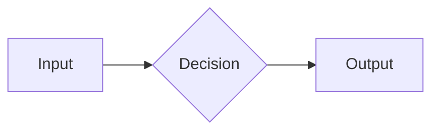

# How to write Notes

No HTML, no coding. Just create a markdown file and save it.

## Quickstart

1. Create a new file in `src/content/notes/your-note-slug.md`
2. Add frontmatter at the top
3. Write markdown below
4. The dev server hot-reloads it instantly. The slug becomes the URL.

```
src/content/notes/
  ├── pre-push-safety.md          → /notes/pre-push-safety
  ├── building-mcp-servers.md     → /notes/building-mcp-servers
  └── your-new-note.md            → /notes/your-new-note
```

## Frontmatter (required)

```yaml
---
title: "Your Note Title"
date: "2026-07-19"          # YYYY-MM-DD
tags: ["tag1", "tag2"]      # optional, shows as pills
desc: "Short blurb."        # optional, shows in listings and SEO
hide: true                  # hide from listings (+ prod routes)
# draft: true               # alias of hide — either works
---
```

## What renders

| Syntax | How to write it |
|---|---|
| **Bold** | `**bold**` |
| _Italic_ | `_italic_` |
| `inline code` | `` `code` `` |
| Link | `[text](https://url)` |
| Blockquote | `> text` |
| Heading | `## H2`, `### H3` |

## Code blocks

Fenced with triple backticks + language name → syntax highlighted (Shiki, dark theme):

````
```python
print("hello")
```
````

Supported: `python`, `bash`, `ts`, `go`, `sql`, `yaml`, `json`, `diff`, and [many more](https://shiki.style/languages).

## Math (LaTeX / KaTeX)

Inline: wrap with single `$`:
```
The impedance is $Z = R + j\omega L$.
```

Block (centered, display): wrap with `$$` on its own lines:
```
$$
V_{out} = V_{in} \cdot \frac{R_2}{R_1 + R_2}
$$
```

Supports the full KaTeX subset — matrices, fractions, Greek letters, operators, etc.
See [KaTeX supported functions](https://katex.org/docs/supported.html).

## Mermaid diagrams

Fenced with ` ```mermaid `:

````

````

Supported diagram types:
- `flowchart` / `graph`
- `sequenceDiagram`
- `classDiagram`
- `erDiagram`
- `gantt`
- `pie`

See [mermaid.js docs](https://mermaid.js.org/intro/).

## CircuiTikZ (TikZ circuits)

Rendered **at build time** with `node-tikzjax` (no browser WASM).

This is intentional for photosensitivity: client TikZJax (e.g. live preview
that recompiles on every keystroke) can strobe white/black frames and has
triggered seizure-like reactions. Here the SVG is baked once per save; prod
pages are static. Dev HMR can still remount the figure — look away while it
reloads if you’re sensitive.

Fenced with ` ```tikz ` or ` ```circuitikz `:

````
```tikz
\usepackage{circuitikz}
\begin{document}
\begin{circuitikz}[american]
\draw (0,0) to[V, v=$V_s$] (0,3)
to[R, l=$R_1$] (3,3)
to[C, l=$C_1$] (3,0) -- (0,0);
\draw (0,0) node[ground]{};
\end{circuitikz}
\end{document}
```
````

Prefer ` ```circuitikz ` / ` ```tikz ` for the full-width figure chrome.
`` embeds work too, but they render at the SVG’s intrinsic size.

## Hiding notes

Set `hide: true` (or `draft: true`) in frontmatter — excluded from `/notes` listings and
production builds. In `astro dev`, the URL still works so you can preview.

## Connecting a real CMS (Supabase / Neon / Cloudflare)

See [`src/lib/cms.ts`](./src/lib/cms.ts) — the `getPosts()` function has commented stubs for:
- **Supabase** (Postgres + REST client)
- **Neon** (serverless Postgres)
- **Cloudflare D1** (SQLite edge)
- **Cloudflare KV** (JSON blob store)

Swap sources by uncommenting the relevant block. The schema is the same across all sources.
