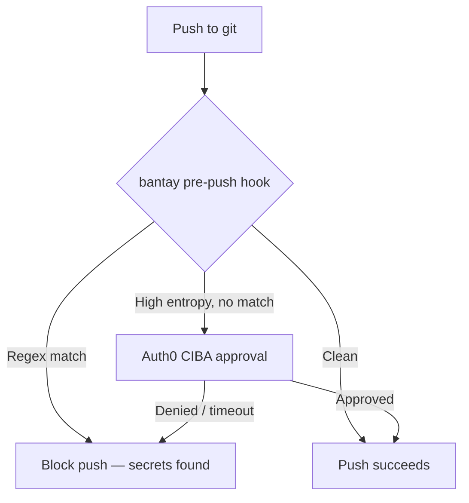
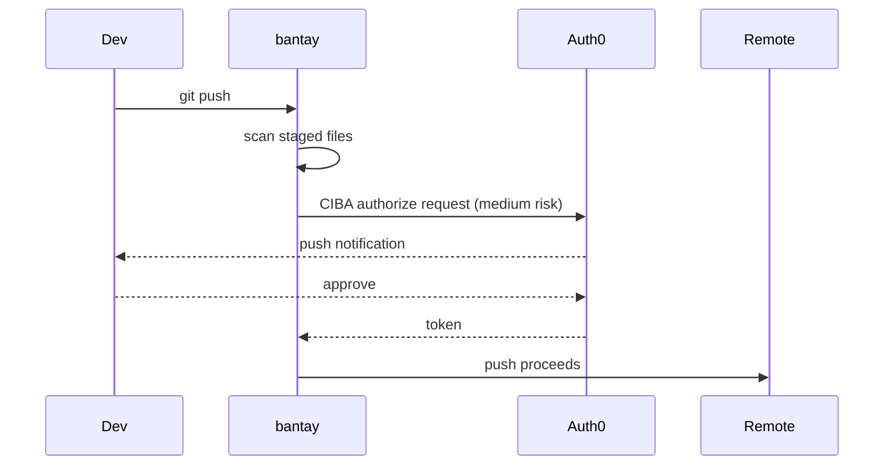
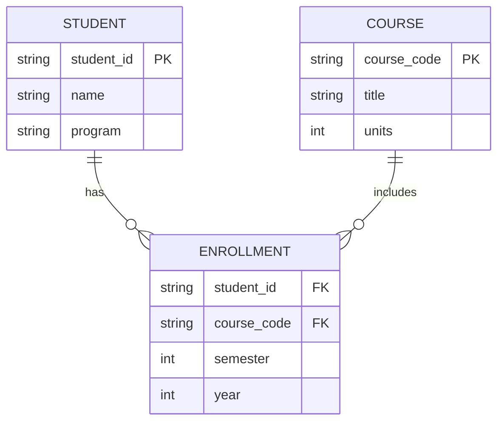

This page is a live reference for everything you can use in a note. All of it is plain markdown — no HTML needed.

## Basic markdown

Standard stuff works: **bold**, _italic_, ~~strikethrough~~, `inline code`, [links](https://github.com/kuyacarlo).

> Blockquotes look like this.

## Code blocks

Fenced code with a language tag gets syntax-highlighted by Shiki (dark theme):

```python
from langchain_core.tools import tool

@tool
def get_student_curriculum(student_id: str, year: int) -> dict:
    """Fetch CHED-verified curriculum for a BulSU student."""
    return fetch_from_db(student_id, year)
```

```bash
git push origin main  # bantay runs pre-push hook here
```

## Math — inline and block

Inline math with single dollar signs: The Fourier transform of $f(t)$ is $\hat{f}(\xi) = \int_{-\infty}^{\infty} f(t)\, e^{-2\pi i \xi t}\, dt$.

Block (display) math with double dollar signs:

$$
\mathbf{H}(j\omega) = \frac{V_{out}}{V_{in}} = \frac{1}{1 + j\omega RC}
$$

$$
\nabla \cdot \mathbf{E} = \frac{\rho}{\varepsilon_0}, \quad
\nabla \times \mathbf{B} = \mu_0 \mathbf{J} + \mu_0\varepsilon_0 \frac{\partial \mathbf{E}}{\partial t}
$$

Matrices:

$$
A = \begin{pmatrix} a_{11} & a_{12} \\ a_{21} & a_{22} \end{pmatrix}, \quad
\det(A) = a_{11}a_{22} - a_{12}a_{21}
$$

## Mermaid diagrams

Flow charts, sequence diagrams, ER diagrams — all supported.



Sequence diagram:



ER diagram:



## CircuiTikZ diagrams

Fenced code with language `tikz`. Uses CircuiTikZ syntax (LaTeX package, rendered client-side via TikZJax):

```tikz
\begin{tikzpicture}
  \draw (0,0) to[V, v=$V_s$] (0,3)
              to[R, l=$R_1$] (3,3)
              to[C, l=$C_1$] (3,0) -- (0,0);
  \draw (3,3) to[R, l=$R_2$] (6,3)
              to[short, -o] (6,2) node[right]{$V_{out}$};
  \draw (6,0) to[short, o-] (0,0) node[ground]{};
\end{tikzpicture}
```

A full-wave rectifier:

```tikz
\begin{tikzpicture}
  \draw (0,2) to[sV, v=$V_{ac}$] (0,0);
  \draw (0,2) to[D, l=$D_1$] (2,3)
              to[short] (4,3)
              to[R, l=$R_L$, v=$V_{out}$] (4,0)
              to[short] (0,0);
  \draw (0,2) to[D, l=$D_3$] (2,1)
              to[D, l=$D_4$] (4,3);
  \draw (2,3) to[D, l=$D_2$] (4,3);
\end{tikzpicture}
```

## Lists and tables

Unordered:
- First item
- Second item
  - Nested item
- Third item

Ordered:
1. Install dependencies
2. Write your note
3. Save — it hot-reloads instantly

Tables:

| Plugin | Purpose | Load |
|---|---|---|
| `remark-math` | Parses `$...$` and `$$...$$` | Build |
| `rehype-katex` | Renders math → HTML | Build |
| `rehype-tikz` | Converts tikz blocks → script tags | Build |
| Mermaid.js | Renders diagram code | Client |
| TikZJax | Renders TikZ/CircuiTikZ (WASM) | Client, lazy |
